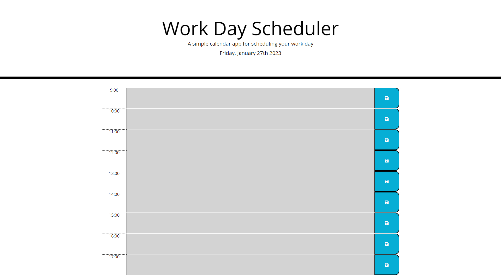

# Work Day Planner

## Description

A simple calendar app for scheduling your work day.

## Features

- Displays the current day at the top of the calendar when a user opens the planner.
- Presents timeblocks for standard business hours when the user scrolls down.
- Color-codes each timeblock based on past, present, and future when the timeblock is viewed.
- Allows a user to enter an event when they click a timeblock.
- Saves the event in local storage when the save button is clicked in that timeblock.
- Persists events between refreshes of a page.

## Usage

1. Follow the [link](https://willguille.github.io/work-day-scheduler/)
2. View the current day at the top of the calendar.
3. Scroll down to view the timeblocks for standard business hours.
4. Click on a timeblock to enter an event.
5. Click the save button to save the event in local storage.
6. Refresh the page to view the persisted events.

## License

Please refer to the LICENSE in the repo.